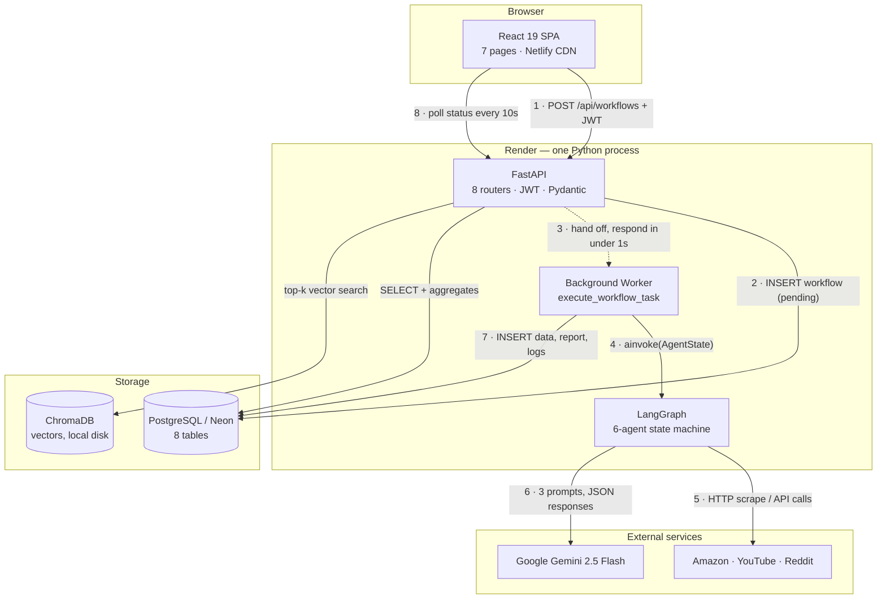
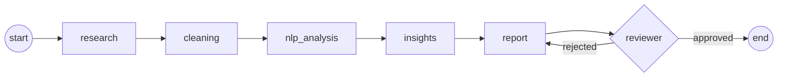
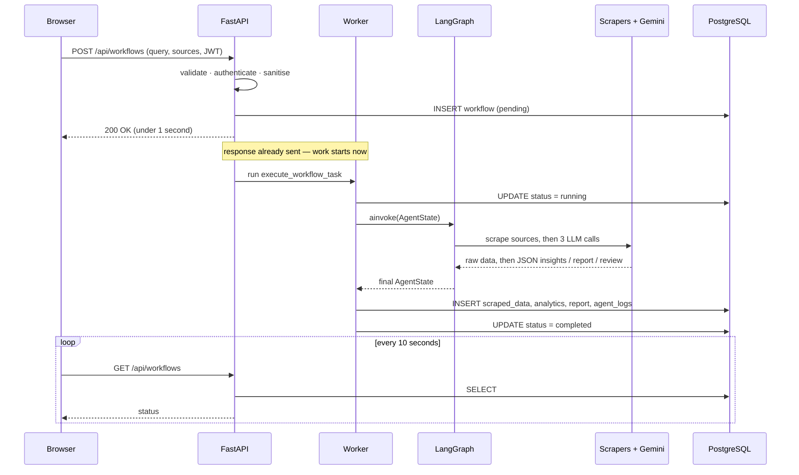
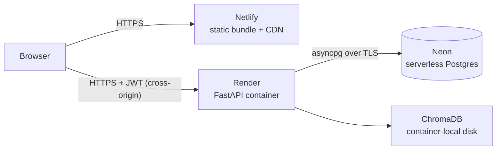

# AgentFlow — Architecture

A standalone explanation of how AgentFlow is put together. Read this on its own; you don't need any other
file. (For interview prep and deeper trade-off discussion, see `PROJECT_GUIDE.md`.)

---

## The architecture in one paragraph

AgentFlow is a **three-tier web application with an asynchronous AI pipeline bolted onto the middle tier.**
A React single-page app talks to one FastAPI service over HTTP. When a user starts a research job, the API
does *not* do the work — it writes a `pending` row, hands the job to a background task, and responds in under
a second. The background task runs a **LangGraph state machine** of six agents that scrape public data, clean
and analyse it, and call **Google Gemini** three times to produce a report. Everything lands in **PostgreSQL**.
The browser polls until the status flips to `completed`.

The single most important idea: **the HTTP request never waits for the AI work.**

---

## 1. System Overview



### Reading the numbered flow

| Step | What happens | Where in the code |
|:--|:--|:--|
| **1** | User submits a query + sources. Axios attaches the JWT from `localStorage` automatically. | `frontend/src/api/client.ts` |
| **2** | Query is validated, sanitised, and a workflow row is written with `status="pending"`. | `api/workflows.py` |
| **3** | The long job is registered as a background task. **The response is sent immediately.** | `BackgroundTasks` |
| **4** | The worker opens its own DB connection, flips status to `running`, and invokes the agent graph. | `workers/tasks.py` |
| **5** | The research agent fans out to the selected scrapers concurrently. | `agents/research_agent.py` |
| **6** | Three agents each make one Gemini call — insights, report, review. | `agents/insight_agent.py`, `report_agent.py`, `reviewer_agent.py` |
| **7** | One transaction writes scraped rows, analytics, the report, and per-agent logs. | `workers/tasks.py` |
| **8** | The browser polls every 10 seconds until status is `completed`. | `pages/Workflows.tsx` |

---

## 2. The four layers

### Layer 1 — Frontend (React 19 + TypeScript, on Netlify)

A single-page app of seven screens: Dashboard, Workflows, Reports, Users, Settings, Login, Signup.

- **Routing** is client-side (React Router v6), with a `ProtectedRoute` wrapper that bounces unauthenticated
  users to `/login`.
- **Auth state** lives in a React Context, backed by `localStorage` so a refresh doesn't log you out.
- **All HTTP goes through one Axios client** with two interceptors: one attaches the JWT to every request, one
  catches any `401`, clears storage and redirects to login. That's the whole auth plumbing in two functions.
- **Deployment** is a static bundle on a CDN, with a catch-all rewrite (`/* → /index.html`) so deep links like
  `/reports` survive a hard refresh.

### Layer 2 — API (FastAPI, on Render)

One async Python service. Every request passes through the same chain:

```
CORS → RequestLogging → Prometheus → Pydantic validation → JWT auth → DB session → route handler
```

- **Eight route groups:** `auth`, `workflows`, `reports`, `dashboard`, `rag`, `schedules`, `monitoring`, `admin`.
- **Validation is declarative** — Pydantic models reject malformed input before any handler code runs, and the
  same models generate the OpenAPI docs at `/docs`.
- **Auth** is a stateless JWT (HS256, 30-minute expiry, user UUID in the `sub` claim), verified by a dependency
  that also re-checks the user is still active.
- **A sanitisation layer sits between the user and every LLM prompt** — length caps, stripping of
  prompt-breaking sequences, and ~20 regexes for prompt-injection patterns. A match is rejected with a 400
  *before* the query is stored or sent anywhere.
- **The API's job on the critical path is to be fast.** Anything slow is handed off.

### Layer 3 — Agent pipeline (LangGraph)

Runs as a background task inside the same process. This is where the actual intelligence lives — see §3.

### Layer 4 — Storage

Two stores, with a clear division of responsibility:

- **PostgreSQL (Neon in production)** — the system of record. Eight tables holding users, jobs, raw evidence,
  computed metrics, reports, and per-agent execution logs. Relational where the shape is fixed; JSON columns
  where the LLM's output shape varies.
- **ChromaDB** — an embedded, on-disk vector store used only by the RAG endpoint, with one collection per
  workflow so questions about one product can't retrieve another's data.

---

## 3. The agent pipeline (zoomed in)



Six nodes, five plain edges, and **one conditional edge** — the reviewer can send the report back, which makes
this a **cycle**, not a straight line. That cycle is the reason a graph framework is used at all instead of
calling six functions in sequence.

### How the agents talk to each other

**They don't.** There is no messaging between agents. Every node receives and returns **one shared typed
dictionary** called `AgentState` (18 keys). Each agent reads the keys it needs and writes the keys it owns:

```
research  → writes raw_data
cleaning  → reads raw_data       → writes cleaned_data
nlp       → reads cleaned_data   → writes sentiment / keywords / topics / trends (VADER, TF-IDF, NMF)
insights  → reads nlp output     → writes insights, competitors, pain_points
report    → reads insights       → writes report
reviewer  → reads report         → writes review_feedback (and decides the next edge)
```

This is a **blackboard pattern**. Adding a seventh agent means adding a node and a key — no existing agent
changes. And because the whole run is one inspectable object, every node can append its own timing and I/O
summary to `agent_logs`, which is what makes the pipeline auditable after the fact.

### What each agent does

| Agent | Job | Uses an LLM? |
|:--|:--|:--|
| **research** | Fan out to Amazon / YouTube / Reddit scrapers concurrently | No |
| **cleaning** | Strip URLs and noise, deduplicate, drop non-English and too-short items | No |
| **nlp_analysis** | VADER sentiment per item, TF-IDF keywords, NMF topics, regression trend direction | No |
| **insights** | Turn raw signals into insights, competitors and pain points | **Yes** |
| **report** | Write the structured 14-section report | **Yes** |
| **reviewer** | Quality-gate the report; approve or send back | **Yes** |

**Only half the agents call an LLM — that's deliberate.** Scraping, cleaning and counting are deterministic
work; an LLM would be slower, more expensive and *less* reliable at them. The model is used only where
judgement is genuinely needed: interpreting, writing, and evaluating.

### Two safety properties built into the graph

- **Concurrency without fragility** — the research agent runs all scrapers via
  `asyncio.gather(..., return_exceptions=True)`, so three sources take as long as the *slowest* one, and one
  source failing does not kill the other two.
- **Guaranteed termination** — the reviewer increments a `revision_count` and force-approves after two
  revisions. A cyclic agent graph must never let an LLM decide when to stop.

---

## 4. Request lifecycle (sequence view)



The gap between "200 OK" and "status = completed" is roughly **30–90 seconds**. Everything in the architecture
above the storage layer exists to make that gap invisible to the user.

---

## 5. Where the data lives

```
users ──┬── workflows ──┬── scraped_data        every comment + its sentiment  (the evidence)
        │               ├── analytics           computed metrics as JSON       (the numbers)
        │               ├── agent_logs          one row per agent execution    (the audit trail)
        │               ├── embeddings_metadata chunk → vector mapping         (the provenance link)
        │               └── reports             the deliverable
        ├── reports
        ├── agent_logs
        └── scheduled_tasks                     recurring re-runs
```

Three ideas hold this schema together:

1. **The evidence is kept, not just the answer.** `scraped_data` stores every comment the report was built
   from, so any claim can be traced back to its source rows.
2. **Every agent execution is logged** with its inputs, outputs and runtime — which makes it possible to answer
   "which agent was slow?" or "which one failed?" without re-running anything.
3. **Fixed shapes get columns; fluid shapes get JSON.** User identity and job status are real typed columns.
   LLM output — recommendations, metric payloads, agent states — goes into JSON columns, so a change in the
   model's output shape doesn't require a schema migration.

UUID primary keys throughout, so IDs in URLs can't be enumerated and the background worker can mint an ID
without a database round-trip.

---

## 6. The five decisions that shaped this architecture

1. **Return immediately, work in the background.** A 60-second job behind a synchronous HTTP request is a
   timeout waiting to happen. Splitting them is what lets the API stay responsive — and it's also why this
   backend needs a long-lived process rather than serverless functions.
2. **Async everywhere.** The workload is almost entirely *waiting* — on scrapers, on Gemini, on the database.
   An async framework lets one process hold many waiting requests instead of one thread each. The
   corollary: any synchronous library (ChromaDB, CPU-bound NLP) must be pushed to a thread pool so it can't
   stall the event loop.
3. **A state machine, not a call chain.** The reviewer's ability to reject a report creates a cycle, and cycles
   are what graphs express and function chains don't.
4. **LLMs only where judgement is needed.** Three of six agents call a model; the rest are deterministic.
5. **Degrade, don't die.** Every external dependency has a fallback: scrapers retry with exponential backoff
   then fall back to sample corpora, the report agent has three tiers of prompt fallback, the reviewer fails
   open, and any uncaught error marks the workflow `failed` rather than vanishing silently.

---

## 7. Deployment topology



- **Frontend and backend are hosted separately** because they're genuinely different workloads: static files
  that want a CDN, versus a long-lived Python process running minute-long jobs.
- **Because the origins differ, CORS is required in production** — but not in development, where the Vite dev
  server proxies `/api` to the backend and everything is same-origin. That asymmetry is worth knowing about.
- **A full Docker Compose stack exists in the repo** (Postgres, backend, frontend, ChromaDB, Prometheus,
  Grafana, MLflow) for local development and demos. Production is the Netlify + Render + Neon path above.

---

## 8. What's wired vs. what's designed

So the diagrams aren't read as promises:

- ✅ **Fully wired:** auth with role-based access control, the workflow API, the six-agent LangGraph
  pipeline, the three Gemini calls, all persistence, PDF/DOCX export, Prometheus request metrics, MLflow
  per-run tracking, and every dashboard endpoint (all now aggregate real rows).
- ✅ **RAG, end to end.** `workers/tasks.py` flushes the scraped rows, then `rag/indexer.py` chunks them
  (800 characters, 100 overlap), embeds each chunk as a 768-dimension `gemini-embedding-001` vector, and
  upserts it into that workflow's own Chroma collection with an `EmbeddingMetadata` row per chunk.
  `rag/retriever.py` embeds the question with the query-side task type, filters hits below a similarity
  floor, and asks Gemini to answer from the retrieved chunks with `[n]` citations.
- ✅ **NLP.** VADER sentiment, TF-IDF keywords with per-keyword sentiment, NMF topic modelling, and
  regression-based trend detection over calendar-binned data.
- ⚠️ **Reddit only:** the Reddit scraper falls back to synthetic data when OAuth credentials are missing,
  because Reddit blocks all unauthenticated access. Amazon and YouTube collect live data with no
  credentials at all. Every item carries `metadata.is_mock`, so the two are never confused, and
  `ALLOW_MOCK_DATA=false` turns the fallback into a hard failure.

### The known limits of this design

- **Background tasks run inside the API process**, so a container restart loses in-flight workflows and there
  is no retry. The fix is a real queue (Celery/Arq + Redis) plus a LangGraph checkpointer so a killed run
  resumes at the last completed node.
- **ChromaDB's disk is ephemeral** on a free-tier container and can't be shared across instances. The natural
  fix is `pgvector` inside the Postgres that's already there — one fewer datastore, and durable vectors.
- **Amazon scraping is inherently fragile.** It warms a session and rotates fingerprints against active bot
  detection, and works today, but Amazon can change its markup or block a marketplace at any time. That is
  why block pages are detected explicitly, three marketplaces are tried in turn, and the fallback is
  labelled rather than silent.
- **Gemini free-tier quotas bind before anything else.** Embedding is capped per minute and generation per
  day, so a large workflow can pause mid-index. Every call path retries with backoff, and RAG degrades to
  returning retrieved context rather than failing outright.
- **Three LLM calls per workflow** means roughly five concurrent workflows saturate a free-tier rate limit.
  That, not CPU or database load, is the first ceiling this system hits.
