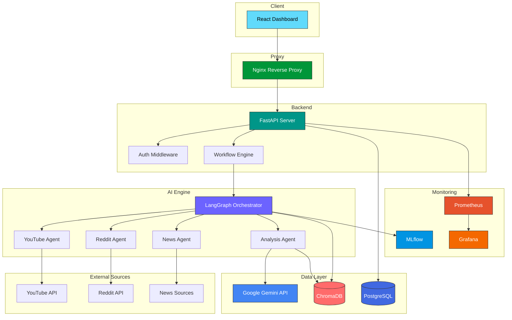

<div align="center">

# AgentFlow AI

### Multi-Agent Market Intelligence Platform

[](https://python.org)
[](https://fastapi.tiangolo.com)
[](https://react.dev)
[](https://typescriptlang.org)
[](https://docker.com)
[](https://postgresql.org)
[](LICENSE)

*Production-grade AI platform that orchestrates intelligent agents to gather, analyze, and deliver real-time market intelligence from multiple data sources.*

---

[**Features**](#-features) · [**Quick Start**](#-quick-start) · [**Architecture**](#-architecture) · [**API Docs**](#-api-documentation) · [**Contributing**](#-contributing)

</div>

---

## About

**AgentFlow AI** is a production-grade, multi-agent market intelligence platform that leverages cutting-edge AI orchestration to provide comprehensive market analysis. Built with **LangGraph** for sophisticated agent workflow management and powered by **Google Gemini**, the platform autonomously scrapes, processes, and analyzes data from YouTube, Reddit, news outlets, and more.

The platform employs **Retrieval-Augmented Generation (RAG)** with ChromaDB for contextual analysis, ensuring insights are grounded in real data. A beautiful **React + TypeScript** dashboard provides interactive visualizations, while **MLflow** tracks experiment performance and **Prometheus + Grafana** deliver enterprise-grade observability.

Whether you're tracking competitor movements, analyzing market sentiment, or discovering emerging trends — AgentFlow AI provides the intelligence you need, when you need it.

---

## Screenshots

<div align="center">

> *Screenshots coming soon — the dashboard features interactive charts, real-time agent monitoring, and comprehensive market analysis views.*

</div>

---

## Features

- 🤖 **Multi-Agent Orchestration** — LangGraph-powered agent workflows with dynamic task routing and parallel execution
- 📊 **Real-Time Market Intelligence** — Continuous monitoring of YouTube, Reddit, news, and social media sources
- 🧠 **RAG-Powered Analysis** — ChromaDB vector storage with context-aware retrieval for grounded insights
- 🎨 **Interactive Dashboard** — React + TypeScript UI with real-time data visualization and workflow management
- 🔄 **Workflow Management** — Create, monitor, and control complex multi-agent analysis pipelines
- 📈 **Comprehensive Monitoring** — Prometheus metrics, Grafana dashboards, and MLflow experiment tracking
- 🔐 **Enterprise Security** — JWT authentication, rate limiting, CORS, and security headers
- 🐳 **One-Command Deployment** — Full Docker Compose stack with health checks and auto-restart

---

## Tech Stack

| Layer | Technology |
|:---|:---|
| **Backend** | Python 3.11 · FastAPI · SQLAlchemy · Alembic · Pydantic |
| **Frontend** | React 18 · TypeScript · Vite · TanStack Query · Recharts |
| **AI / ML** | Google Gemini · LangGraph · LangChain · ChromaDB (RAG) |
| **Database** | PostgreSQL 16 · ChromaDB (Vector Store) |
| **Monitoring** | Prometheus · Grafana · MLflow · Structured Logging |
| **DevOps** | Docker · Docker Compose · Nginx · GitHub Actions · Makefile |

---

## Architecture



---

## Quick Start

### Prerequisites
- **Python** 3.11+
- **Node.js** 20+
- **Git**

### 1. Setup Backend
```bash
cd backend
python -m venv venv
source venv/bin/activate  # On Windows: venv\Scripts\activate
pip install -r requirements.txt
### Frontend

```bash
cd frontend

# Install dependencies
npm install

# Start development server
npm run dev
```

### Using Make

```bash
make setup    # Initial setup
make dev      # Start development environment
make test     # Run tests
make format   # Format code
make logs     # Follow Docker logs
```

---

## API Documentation

AgentFlow AI provides interactive API documentation:

- **Swagger UI**: `/docs` (Available when running locally at `http://localhost:8000/docs`)
- **ReDoc**: `/redoc` (Available when running locally at `http://localhost:8000/redoc`)

### Key Endpoints

| Method | Endpoint | Description |
|:---|:---|:---|
| `POST` | `/api/auth/login` | Authenticate and receive JWT token |
| `GET` | `/api/workflows` | List all workflows |
| `POST` | `/api/workflows` | Create a new analysis workflow |
| `GET` | `/api/workflows/{id}` | Get workflow status and results |
| `POST` | `/api/agents/execute` | Trigger agent execution |
| `GET` | `/api/intelligence/reports` | Retrieve analysis reports |
| `GET` | `/api/monitoring/metrics` | Prometheus metrics endpoint |
| `GET` | `/api/health` | Health check |

---

## Project Structure

```
AgentFlow/
├── backend/                    # FastAPI Backend
│   ├── alembic/               # Database migrations
│   │   ├── versions/          # Migration files
│   │   ├── env.py             # Alembic environment config
│   │   └── script.py.mako     # Migration template
│   ├── app/
│   │   ├── agents/            # LangGraph agent definitions
│   │   ├── api/               # API route handlers
│   │   ├── core/              # Config, security, dependencies
│   │   ├── models/            # SQLAlchemy ORM models
│   │   ├── schemas/           # Pydantic request/response schemas
│   │   ├── services/          # Business logic layer
│   │   ├── database.py        # Database connection setup
│   │   └── main.py            # FastAPI application entry
│   ├── tests/                 # Backend test suite
│   ├── alembic.ini            # Alembic configuration
│   ├── Dockerfile             # Backend container
│   └── requirements.txt       # Python dependencies
├── frontend/                   # React Frontend
│   ├── src/
│   │   ├── components/        # Reusable UI components
│   │   ├── pages/             # Page components
│   │   ├── hooks/             # Custom React hooks
│   │   ├── services/          # API client services
│   │   ├── stores/            # State management
│   │   └── types/             # TypeScript type definitions
│   ├── Dockerfile             # Frontend container
│   ├── nginx.conf             # Frontend Nginx config
│   └── package.json           # Node dependencies
├── monitoring/                 # Observability Stack
│   ├── grafana/
│   │   └── dashboards/        # Grafana dashboard configs
│   ├── mlflow/
│   │   └── Dockerfile         # MLflow server container
│   └── prometheus/
│       └── prometheus.yml     # Prometheus scrape config
├── nginx/                      # Reverse Proxy
│   └── nginx.conf             # Main Nginx configuration
├── .github/
│   └── workflows/
│       └── ci-cd.yml          # GitHub Actions pipeline
├── .env.example               # Environment variable template
├── .gitignore                 # Git ignore rules
├── docker-compose.yml         # Docker Compose orchestration
├── Makefile                   # Development commands
└── README.md                  # This file
```

---

## Contributing

We welcome contributions! Here's how to get started:

1. **Fork** the repository
2. **Create** a feature branch: `git checkout -b feature/amazing-feature`
3. **Commit** your changes: `git commit -m 'feat: add amazing feature'`
4. **Push** to the branch: `git push origin feature/amazing-feature`
5. **Open** a Pull Request

### Development Guidelines

- Follow [Conventional Commits](https://www.conventionalcommits.org/)
- Write tests for new features
- Run `make format` and `make lint` before committing
- Update documentation as needed

---

## License

This project is licensed under the **MIT License** — see the [LICENSE](LICENSE) file for details.

---

<div align="center">

**Built with ❤️ by the AgentFlow AI Team**

[⬆ Back to Top](#-agentflow-ai)

</div>
