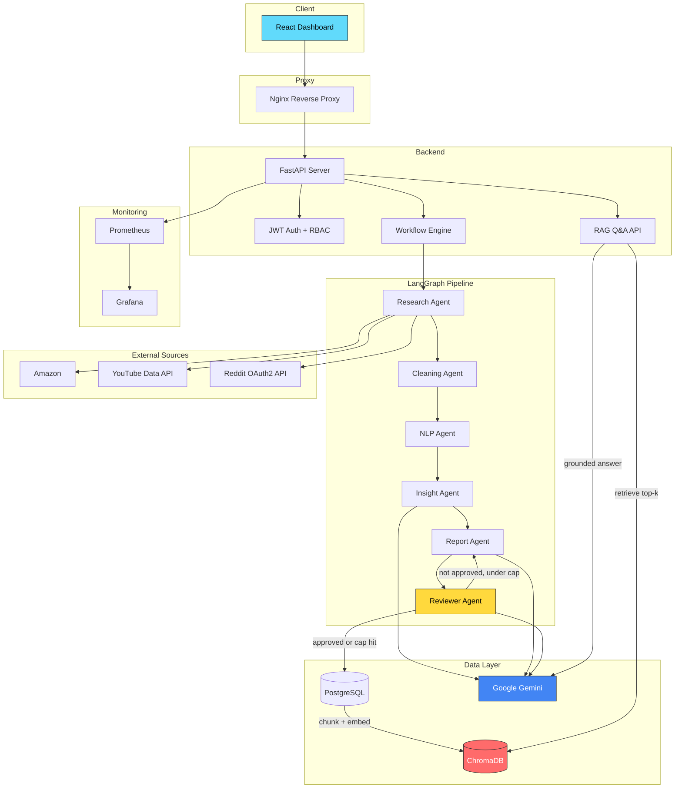

<div align="center">

# AgentFlow AI

### Multi-Agent Market Intelligence Platform

[](https://python.org)
[](https://fastapi.tiangolo.com)
[](https://react.dev)
[](https://typescriptlang.org)
[](https://docker.com)
[](https://postgresql.org)
[](LICENSE)

*Production-grade AI platform that orchestrates intelligent agents to gather, analyze, and deliver real-time market intelligence from multiple data sources.*

---

[**Features**](#-features) · [**Quick Start**](#-quick-start) · [**Architecture**](#-architecture) · [**API Docs**](#-api-documentation) · [**Contributing**](#-contributing)

</div>

---

## About

**AgentFlow AI** is a production-grade, multi-agent market intelligence platform that leverages cutting-edge AI orchestration to provide comprehensive market analysis. Built with **LangGraph** for sophisticated agent workflow management and powered by **Google Gemini**, the platform autonomously scrapes, processes, and analyzes data from Amazon, YouTube, and Reddit.

Every completed workflow is embedded into its own ChromaDB collection, so the corpus behind a report stays queryable: **Retrieval-Augmented Generation (RAG)** answers follow-up questions using only that workflow's data, with inline source citations. A **React + TypeScript** dashboard provides interactive visualizations, and **Prometheus + Grafana** deliver request-level observability.

Whether you're tracking competitor movements, analyzing market sentiment, or discovering emerging trends — AgentFlow AI provides the intelligence you need, when you need it.

---

## Features

- 🤖 **Multi-Agent Orchestration** — LangGraph-powered agent workflows with dynamic task routing and parallel execution
- 📊 **Multi-Source Collection** — Concurrent collection from Amazon (detail-page review scraping), YouTube (Data API v3, falling back to keyless innertube), and Reddit (OAuth2 API)
- 🧠 **RAG-Powered Q&A** — Per-workflow ChromaDB collections with Gemini embeddings, similarity-filtered retrieval, and cited answers
- 🔬 **Real NLP Pipeline** — VADER sentiment (handles negation and intensifiers), TF-IDF keyword extraction with per-keyword sentiment, NMF topic modelling, and regression-based trend detection
- 🎨 **Interactive Dashboard** — React + TypeScript UI with real-time data visualization and workflow management
- 🔄 **Workflow Management** — Create, monitor, and control complex multi-agent analysis pipelines
- 📈 **Observability** — Prometheus request metrics at `/metrics`, Grafana dashboards, structured JSON logging, and MLflow tracking of every workflow run (live-data ratio, per-agent latency, sentiment, revisions)
- 🛡️ **Honest Data Provenance** — Every collected item is flagged `is_mock`, so synthetic demo data can never be mistaken for real data; set `ALLOW_MOCK_DATA=false` to make a source failure raise instead
- 🔐 **Enterprise Security** — JWT authentication, rate limiting, CORS, and security headers
- 🐳 **One-Command Deployment** — Full Docker Compose stack with health checks and auto-restart

---

## Tech Stack

| Layer | Technology |
|:---|:---|
| **Backend** | Python 3.11 · FastAPI · SQLAlchemy · Alembic · Pydantic |
| **Frontend** | React 19 · TypeScript · Vite · Tailwind CSS · Zustand · Axios · Recharts |
| **AI / ML** | Google Gemini (chat + embeddings) · LangGraph · LangChain · ChromaDB (RAG) |
| **NLP** | VADER (sentiment) · scikit-learn TF-IDF + NMF (keywords, topics) · langdetect |
| **Database** | PostgreSQL 16 · ChromaDB (Vector Store) |
| **Monitoring** | Prometheus · Grafana · MLflow (per-run experiment tracking) · structlog |
| **DevOps** | Docker · Docker Compose · Nginx · GitHub Actions · Alembic · Makefile |

---

## Architecture


```mermaid
graph TB
    subgraph Client
        UI[React Dashboard]
    end

    subgraph Proxy
        NG[Nginx Reverse Proxy]
    end

    subgraph Backend
        API[FastAPI Server]
        AUTH[JWT Auth + RBAC]
        WF[Workflow Engine]
        RAGAPI[RAG Q&A API]
    end

    subgraph "LangGraph Pipeline"
        RES[Research Agent]
        CLN[Cleaning Agent]
        NLP[NLP Agent]
        INS[Insight Agent]
        REP[Report Agent]
        REV[Reviewer Agent]
    end

    subgraph "External Sources"
        AZ[Amazon]
        YT[YouTube Data API]
        RD[Reddit OAuth2 API]
    end

    subgraph "Data Layer"
        PG[(PostgreSQL)]
        CR[(ChromaDB)]
        GEM[Google Gemini]
    end

    subgraph Monitoring
        PROM[Prometheus]
        GRAF[Grafana]
    end

    UI --> NG
    NG --> API
    API --> AUTH
    API --> WF
    API --> RAGAPI

    WF --> RES
    RES --> CLN --> NLP --> INS --> REP --> REV
    REV -->|not approved, under cap| REP
    REV -->|approved or cap hit| PG

    RES --> AZ & YT & RD
    INS & REP & REV --> GEM

    PG -->|chunk + embed| CR
    RAGAPI -->|retrieve top-k| CR
    RAGAPI -->|grounded answer| GEM

    API --> PROM
    PROM --> GRAF

    style UI fill:#61DAFB,stroke:#333,color:#000
    style CR fill:#FF6B6B,stroke:#333,color:#fff
    style GEM fill:#4285F4,stroke:#333,color:#fff
    style REV fill:#FFD93D,stroke:#333,color:#000
```

---

## Quick Start

### Prerequisites
- **Python** 3.11+
- **Node.js** 20+
- **Docker** (optional, for the full stack)
- **Git**

### 1. Configure environment

Every other step depends on this one — `docker-compose.yml` reads `.env`,
and the backend loads it through pydantic-settings.

```bash
cp .env.example .env
```

Then open `.env` and set `GEMINI_API_KEY`. That single key powers report
generation, insight extraction, and RAG embeddings. Everything else is
optional — see [Data sources](#data-sources) below.

### 2. Setup Backend

```bash
cd backend
python -m venv venv
source venv/bin/activate  # On Windows: venv\Scripts\activate
pip install -r requirements.txt

# Create the database schema
alembic upgrade head

# Start the API server
uvicorn app.main:app --reload --port 8000
```

The first account you register becomes the admin; everyone after is a
regular user.

### 3. Setup Frontend

```bash
cd frontend
npm install
npm run dev
```

### Run the full stack with Docker

```bash
cp .env.example .env    # required — compose will not start without it
docker compose up --build
```

Brings up 8 services: PostgreSQL, backend, frontend, ChromaDB, MLflow,
Prometheus, Grafana, and Nginx.

### Running tests

```bash
cd backend && pytest -q
```

The suite is deliberately offline — it needs no API keys and makes no
network calls, so it runs identically locally and in CI.

---

## Data sources

| Source | Credentials | Behaviour without them |
|:---|:---|:---|
| **YouTube** | None required | Live. Uses the Data API when `YOUTUBE_API_KEY` is set, otherwise innertube — youtube.com's own JSON API |
| **Amazon** | None required | Live. Session-warmed detail-page scraping across 3 marketplaces |
| **Reddit** | **Required** | Falls back to synthetic data. Reddit blocks all unauthenticated access, so live collection needs an app from [reddit.com/prefs/apps](https://www.reddit.com/prefs/apps) (type "script") |

Every collected item carries `metadata.is_mock`, so synthetic demo data is
always distinguishable from real data. Set `ALLOW_MOCK_DATA=false` to make
a source failure raise instead of silently falling back.

### Using Make

```bash
make setup    # Initial setup
make dev      # Start development environment
make test     # Run tests
make format   # Format code
make logs     # Follow Docker logs
```

---

## API Documentation

AgentFlow AI provides interactive API documentation:

- **Swagger UI**: `/docs` (Available when running locally at `http://localhost:8000/docs`)
- **ReDoc**: `/redoc` (Available when running locally at `http://localhost:8000/redoc`)

### Key Endpoints

| Method | Endpoint | Description |
|:---|:---|:---|
| `POST` | `/api/auth/register` | Create an account |
| `POST` | `/api/auth/login` | Authenticate and receive JWT token |
| `GET` | `/api/workflows/` | List all workflows |
| `POST` | `/api/workflows/` | Create a new analysis workflow |
| `GET` | `/api/workflows/{id}` | Get workflow status and results |
| `GET` | `/api/reports/` | Retrieve analysis reports |
| `GET` | `/api/reports/{id}/export/pdf` | Export a report as PDF |
| `GET` | `/api/dashboard/overview` | Aggregate dashboard metrics |
| `POST` | `/api/rag/query` | Ask a question answered only from a workflow's own corpus |
| `POST` | `/api/rag/index` | Rebuild a workflow's vector index |
| `GET` | `/api/rag/status/{id}` | Whether a workflow's corpus is queryable |
| `GET` | `/api/monitoring/health` | Health check |
| `GET` | `/metrics/` | Prometheus metrics endpoint |

---

## Project Structure

```
AgentFlow/
├── backend/                    # FastAPI Backend
│   ├── alembic/               # Database migrations
│   │   ├── versions/          # Migration files
│   │   ├── env.py             # Alembic environment config
│   │   └── script.py.mako     # Migration template
│   ├── app/
│   │   ├── agents/            # LangGraph agent definitions
│   │   ├── api/               # API route handlers
│   │   ├── core/              # Config, security, logging, middleware
│   │   ├── models/            # SQLAlchemy ORM models
│   │   ├── nlp/               # Sentiment, topics, keywords, trends
│   │   ├── rag/               # Embeddings, vector store, retriever
│   │   ├── schemas/           # Pydantic request/response schemas
│   │   ├── scrapers/          # Amazon, YouTube, Reddit scrapers
│   │   ├── services/          # Business logic layer
│   │   ├── workers/           # Background task workers
│   │   ├── config.py          # App configuration (env vars)
│   │   ├── database.py        # Database connection setup
│   │   └── main.py            # FastAPI application entry
│   ├── tests/                 # Backend test suite
│   ├── alembic.ini            # Alembic configuration
│   ├── Dockerfile             # Backend container
│   ├── pytest.ini             # Pytest configuration
│   └── requirements.txt       # Python dependencies
├── frontend/                   # React Frontend
│   ├── src/
│   │   ├── api/               # Axios API client
│   │   ├── components/        # Reusable UI components
│   │   ├── context/           # React context providers
│   │   └── pages/             # Page components
│   ├── Dockerfile             # Frontend container
│   ├── nginx.conf             # Frontend Nginx config
│   └── package.json           # Node dependencies
├── monitoring/                 # Observability Stack
│   ├── grafana/
│   │   └── dashboards/        # Grafana dashboard configs
│   ├── mlflow/
│   │   └── Dockerfile         # MLflow server container
│   └── prometheus/
│       └── prometheus.yml     # Prometheus scrape config
├── nginx/                      # Reverse Proxy
│   └── nginx.conf             # Main Nginx configuration
├── .env.example               # Environment variable template
├── .gitignore                 # Git ignore rules
├── docker-compose.yml         # Docker Compose orchestration
├── Makefile                   # Development commands
└── README.md                  # This file
```

---

## Contributing

We welcome contributions! Here's how to get started:

1. **Fork** the repository
2. **Create** a feature branch: `git checkout -b feature/amazing-feature`
3. **Commit** your changes: `git commit -m 'feat: add amazing feature'`
4. **Push** to the branch: `git push origin feature/amazing-feature`
5. **Open** a Pull Request

### Development Guidelines

- Follow [Conventional Commits](https://www.conventionalcommits.org/)
- Write tests for new features
- Run `make format` and `make lint` before committing
- Update documentation as needed

---

## License

This project is licensed under the **MIT License** — see the [LICENSE](LICENSE) file for details.

---

<div align="center">

**Built with ❤️ by the AgentFlow AI Team**

[⬆ Back to Top](#-agentflow-ai)

</div>
